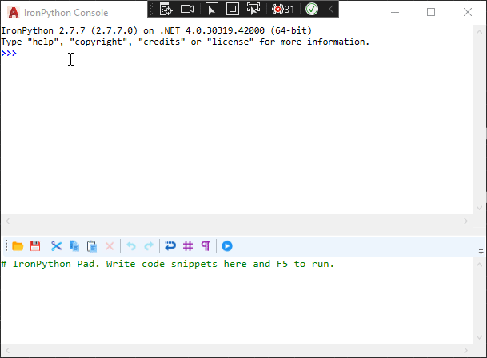

# CADPythonShell


[](https://opensource.org/licenses/MIT)
<a href="https://twitter.com/intent/follow?screen_name=chuongmep">
        </a>


## Introduction

This is obviously a fork of [RevitPythonShell](https://github.com/architecture-building-systems/revitpythonshell), bringing an IronPython interpreter to Autodesk Autocad,
and it would not be possible without the great work of everyone involved with the RPS project. It's still pretty rough around the edges and provides only basic functionality at this time. I'm sharing my work so far, in the hopes that together we can expand it further.

The CADPythonShell (CPS) ,lets you to write plugins for Autocad in Python, provides you with an interactive shell that lets you see the results of your code *as you type it*. This is great for exploring the Autocad API.

The biggest limitation is that you can't deploy DLLs with custom scripts at this time and you can't subscribe to events at startup time.
## Features

- Interactive IronPython interpreter for exploring the API
  - With syntax highlighting and autocompletion (in the console only)
  - Based on the [IronLab](http://code.google.com/p/ironlab/) project
- Batteries included! (Python standard library is bundled as a resource in the `RpsRuntime.dll`)
- Full access to the .NET framework and the Navis API
- Configurable "environment" variables that can be used in your scripts
- Save "external scripts" for reuse and start collecting your awesome hacks!
- Run scripts at Autocad startup

## Installation

- Reference the version of "acdbmgd.dll" and "accoremgd.dll" that you'd like to target.
- Compile the solution.
- Command netload and load CADPythonShell.dll
- Use command "PythonConsole" to open Console or use command "PythonShellSetting" to open form setting

## How to use

- Open Python Console from command line.


- Write Console

``` py
ed = doc.Editor
ed.WriteMessage("Hello")
```


Note : you can see more example in folder `Script Examples`

## Contribute

- Don't hesitate to file any issues you stumble uppon. (Tho I don't guarantee I'll be able to solve them all for you)

## Getting started:

Learn some python:

  * [The Python Tutorial](https://docs.python.org/2/tutorial/)
  * [Dive Into Python](http://www.diveintopython.net/)

Learn about the Autocad API:

  * ADN [Autodesk Developer Network](https://www.autodesk.com/developer-network/overview)
  * [The Autocad SDK"](https://www.autodesk.com/developer-network/platform-technologies/autocad/objectarx)
   

## License

This project is licensed under the terms of the [MIT License](http://opensource.org/licenses/MIT).
## Sponsors

Thanks to [JetBrains](https://www.jetbrains.com/) for providing licenses for [Rider](https://www.jetbrains.com/rider/) and [dotUltimate](https://www.jetbrains.com/dotnet/) tools, which both make open-source development a real pleasure!

## Credits

  * Daren Thomas (original RPS Developer) [RPS](https://github.com/architecture-building-systems/revitpythonshell)
  * Joe Moorhouse (interactive shell was taken from his project [IronLab](http://ironlab.net/))
  * [Dimitar Venkov](https://github.com/dimven/NavisPythonShell) (original port to Navisworks)
  * [ChuongMep](https://github.com/chuongmep) (original port to Autocad)
  * The rest of the RPS contributors
